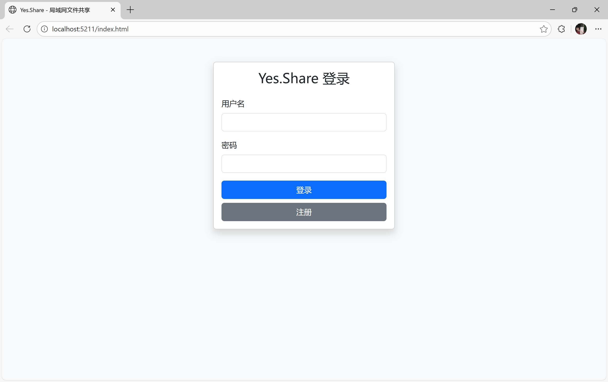
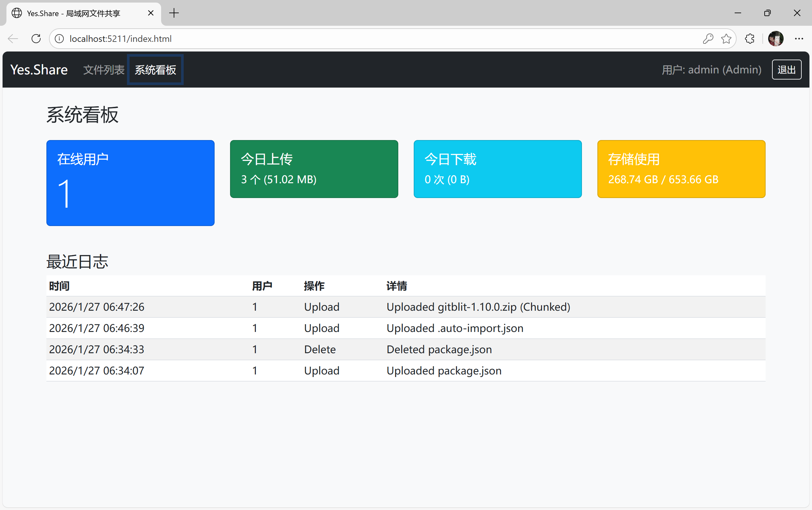
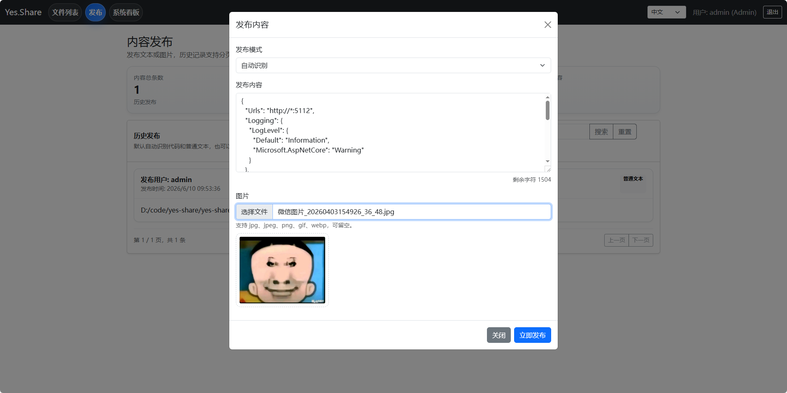
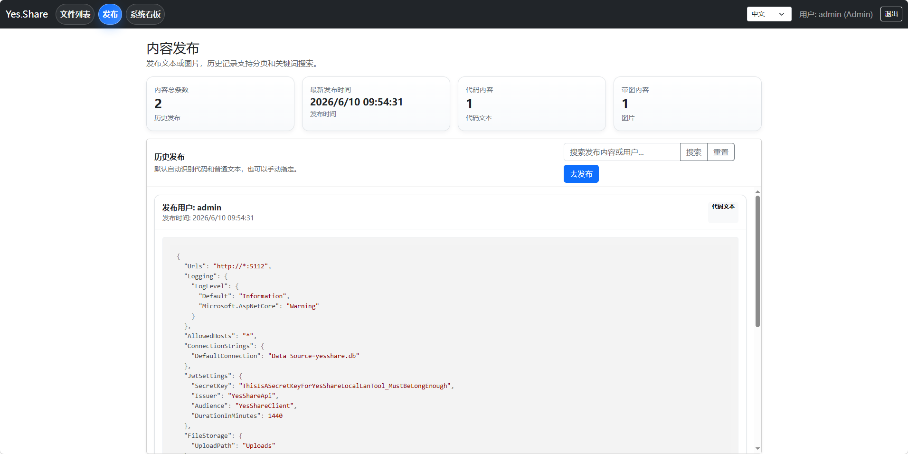
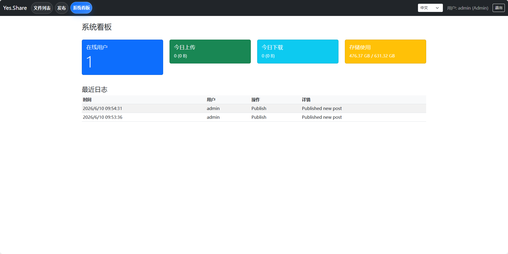
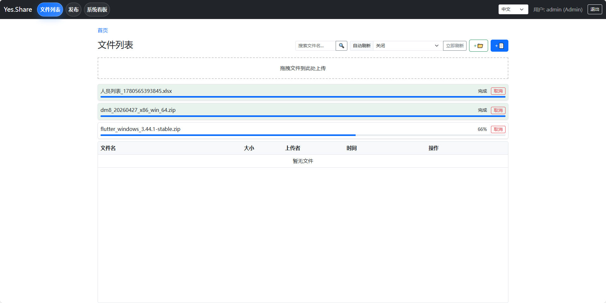
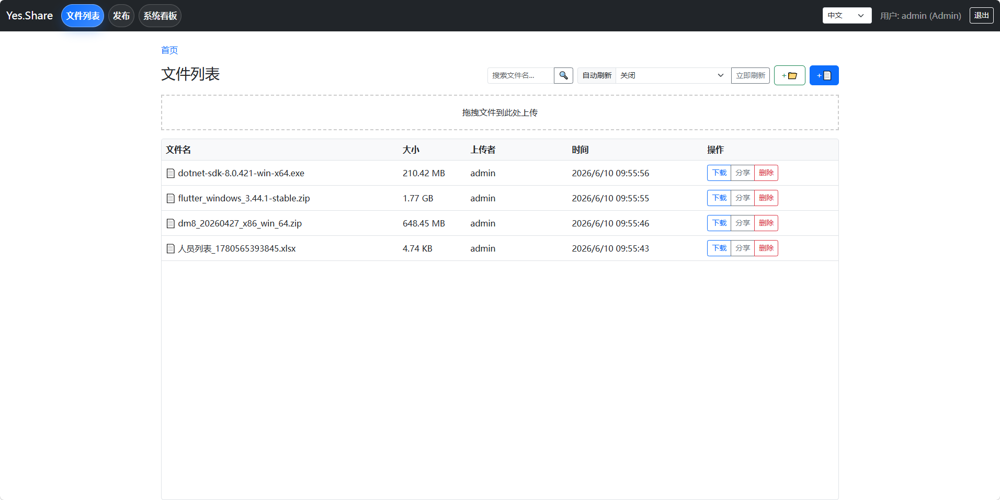

# Yes.Share - 局域网文件共享与内容发布工具

[中文](README.md) | [English](README_EN.md)

> 🚀 一个基于 .NET 8 构建的高性能、安全且易于部署的局域网文件共享与内容发布解决方案。

**仓库地址**
- Gitee: https://gitee.com/ndkkztf/yes-share.git
- GitHub: https://github.com/guofanw/yesShare.git

### ⚙️ 技术栈

- **后端**: [.NET 8](https://dotnet.microsoft.com/) WebAPI, Entity Framework Core 8
- **数据库**: [SQLite](https://www.sqlite.org/)（嵌入式数据库，零配置）
- **前端**: 原生 JavaScript (ES6+), Bootstrap 5, Highlight.js
- **鉴权**: JWT (JSON Web Tokens)
- **开发工具**: Visual Studio / VS Code

### ✨ 核心功能与亮点

- 📦 **大文件分片上传**: 支持 20GB+ 超大文件上传，内置自动分片与断点续传机制，确保局域网传输的稳定性与效率。
- 📁 **文件夹与路径导航**: 支持树形目录浏览、进入文件夹、路径回溯和搜索。
- 👀 **文本、图片、代码在线预览**: 支持文本、图片和代码内容预览，代码内容带语法高亮与复制能力。
- 📝 **发布模块**: 支持发布普通文本、代码文本和图片，支持图片预览、历史分页、关键词搜索和顶部统计信息展示。
- 🤖 **代码自动识别**: 可自动识别普通文本与代码文本，也支持用户手动切换模式。
- 📊 **实时系统看板**: 展示在线用户数、今日上传/下载流量统计、服务器磁盘空间使用率及最近操作日志。
- 🔐 **细粒度权限控制**: 基于 JWT 的身份验证与 RBAC 权限模型，支持私有文件保护、公开分享链接（Token）及管理员审计。
- 🧩 **本地静态资源**: 前端依赖全部使用本地文件，不依赖线上 CDN，适合纯内网环境。
- 🚀 **单文件独立部署**: 支持打包为单一可执行文件（Self-contained），无需在目标机器安装 .NET Runtime，即拷即用。

### 🆕 发布模块说明

- 支持发布内容类型：
  - 普通文本
  - 代码文本
  - 图片
- 文本长度最大 `2000` 字符
- 代码文本支持语法高亮
- 支持的代码语言包括：
  - `Json`
  - `C#`
  - `TypeScript`
  - `CMD`
  - `Vue`
  - `C++`
  - `Java`
  - `Html`
- 支持自动识别代码与普通文本，也支持手动选择
- 历史记录支持分页和按关键词搜索
- 发布页顶部展示：
  - 内容总条数
  - 最新发布时间
  - 代码内容条数
  - 带图内容条数

### 🚀 快速开始

#### 前置要求

- [.NET 8 SDK](https://dotnet.microsoft.com/download/dotnet/8.0)（仅开发或构建时需要）
- 现代浏览器（Chrome、Edge、Firefox 等）
- Git

#### 克隆仓库

```bash
git clone https://gitee.com/ndkkztf/yes-share.git
git clone https://github.com/guofanw/yesShare.git

cd yes-share
```

### 📦 安装与运行

#### 1. 配置环境

项目默认使用 `appsettings.json` 进行配置，开箱即用。进入 API 项目目录：

```bash
cd yes-share-api/Yes.Share.Api
```

如有需要，你可以修改 `appsettings.json` 中的 `JwtSettings` 以增强安全性：

```json
"JwtSettings": {
  "SecretKey": "YourSuperSecretKeyHere_MustBeLongEnough",
  "DurationInMinutes": 1440
}
```

#### 2. 运行开发服务器

```bash
dotnet run
```

默认监听地址配置如下：

```json
"Urls": "http://*:5112"
```

启动成功后，浏览器访问 `http://localhost:5112` 即可进入应用。开发环境下可通过 `http://localhost:5112/swagger` 查看接口文档。

> **注意**：首次运行会自动在项目目录下创建 SQLite 数据库文件 `yesshare.db`，并自动补齐发布模块所需数据表与默认管理员账号。
>
> - **默认管理员**: `admin`
> - **默认密码**: `admin123`

### 📡 主要接口

#### 认证

- `POST /api/auth/login`
- `POST /api/auth/register`

#### 文件

- `GET /api/file`
- `POST /api/file/upload`
- `POST /api/file/upload/chunk/init`
- `POST /api/file/upload/chunk/append/{uploadId}`
- `POST /api/file/upload/chunk/finish/{uploadId}`
- `GET /api/file/{id}/download`

#### 发布

- `POST /api/publish`
- `GET /api/publish`
- `GET /api/publish/{id}/image`

#### 系统看板

- `GET /api/system/dashboard`

### 🔨 项目构建与发布

推荐使用 .NET 发布功能生成独立可执行文件，方便在局域网内任意 Windows 服务器或主机上部署。

#### 构建独立单文件（Windows x64）

```bash
dotnet publish -c Release -r win-x64 --self-contained -p:PublishSingleFile=true
```

构建完成后，可执行文件位于 `bin/Release/net8.0/win-x64/publish/` 目录。将该目录下的 `Yes.Share.Api.exe`、`wwwroot` 文件夹以及必要的配置文件复制到目标服务器即可运行。

#### Docker 部署（可选）

```dockerfile
FROM mcr.microsoft.com/dotnet/sdk:8.0 AS build
WORKDIR /src
COPY . .
RUN dotnet publish "yes-share-api/Yes.Share.Api/Yes.Share.Api.csproj" -c Release -o /app/publish

FROM mcr.microsoft.com/dotnet/aspnet:8.0
WORKDIR /app
COPY --from=build /app/publish .
ENTRYPOINT ["dotnet", "Yes.Share.Api.dll"]
```

### 🖼️ 项目截图









### 📁 目录结构

```text
yes-share/
├─ imgs/
├─ yes-share-api/
│  ├─ Yes.Share.Api/
│  │  ├─ Controllers/
│  │  ├─ Data/
│  │  ├─ Dtos/
│  │  ├─ Filters/
│  │  ├─ Models/
│  │  ├─ Services/
│  │  ├─ Uploads/
│  │  └─ wwwroot/
│  └─ yes-share-api.sln
├─ README.md
├─ README_EN.md
└─ LICENSE
```

### 🌐 本地资源说明

前端依赖均使用本地静态资源，不依赖线上 CDN，适合纯内网环境部署：

- `wwwroot/css/bootstrap.min.css`
- `wwwroot/js/bootstrap.bundle.min.js`
- `wwwroot/css/highlight.min.css`
- `wwwroot/js/highlight.min.js`

### 🤝 贡献指南

欢迎提交 Pull Request 或 Issue！

1. Fork 本仓库
2. 创建特性分支 (`git checkout -b feature/AmazingFeature`)
3. 提交更改 (`git commit -m 'Add some AmazingFeature'`)
4. 推送到分支 (`git push origin feature/AmazingFeature`)
5. 提交 Pull Request

### 📄 许可证

本项目采用 [MIT License](LICENSE) 许可证。
